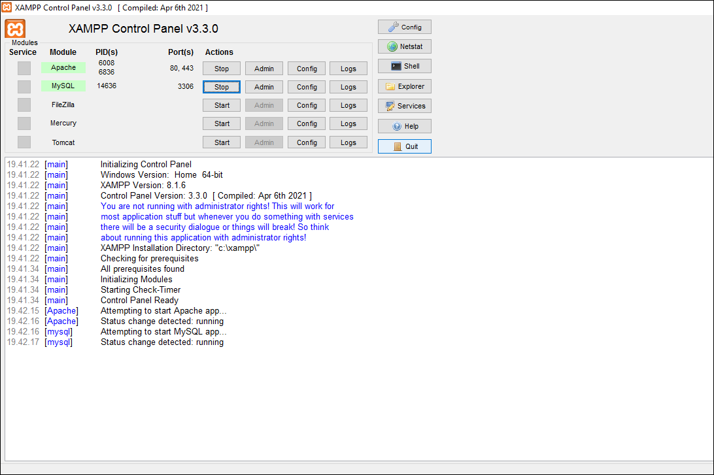

# Lab8web

Nama    : Aka erlanda

Nim     : 312010207

Kelas   : TI.20.B.1

# Pratikum 8 Pemgrograman web

<b>Persiapan</b>

Untuk memulai membuat aplikasi CRUD sederhana, yang perlu disiapkan adalah database server menggunakan MySQL. Pastikan MySQL Server sudah dapat dijalankan melalui XAMPP.

<b>1. Menjalankan MySQL Server</b>

