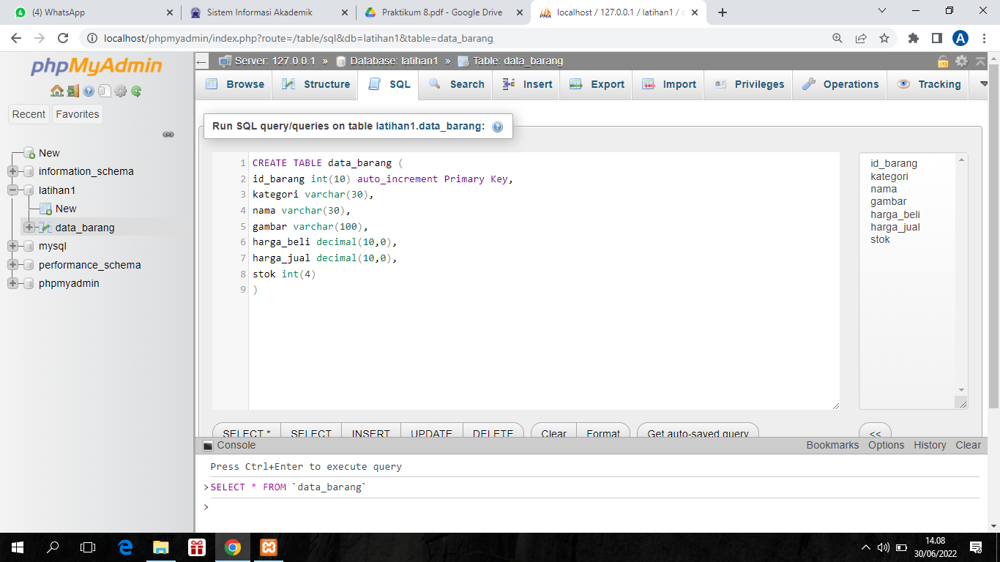
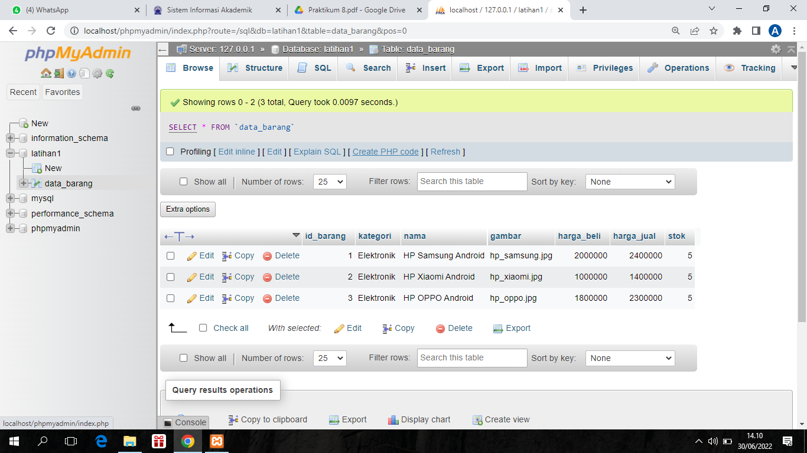

# Lab8web

Nama    : Aka erlanda

Nim     : 312010207

Kelas   : TI.20.B.1

# Pratikum 8 Pemgrograman web

<b>Persiapan</b>

Untuk memulai membuat aplikasi CRUD sederhana, yang perlu disiapkan adalah database server menggunakan MySQL. Pastikan MySQL Server sudah dapat dijalankan melalui XAMPP.

<b>1. Menjalankan MySQL Server</b>

<b>2. Mengakses MySQL Client menggunakan PHP MyAdmin</b>

Pastikan webserver Apache dan MySQL server sudah dijalankan. Kemudian buka melalui browser: http://localhost/phpmyadmin/

<b>3. Membuat Database: Studi Kasus Data Barang</b>
<b>- Membuat Databa

CREATE DATABASE latihan1;

<b>- Membuat Tabel</b>

CREATE TABLE data_barang (
 id_barang int(10) auto_increment Primary Key,
 kategori varchar(30),
 nama varchar(30),
 gambar varchar(100),
 harga_beli decimal(10,0),
 harga_jual decimal(10,0),
 stok int(4)
);

<u>Seperti berikut contoh nya :</u>

<b>- Menambahkan Data</b>

INSERT INTO data_barang (kategori, nama, gambar, harga_beli, harga_jual, stok)
VALUES ('Elektronik', 'HP Samsung Android', 'hp_samsung.jpg', 2000000, 2400000, 5),
('Elektronik', 'HP Xiaomi Android', 'hp_xiaomi.jpg', 1000000, 1400000, 5),
('Elektronik', 'HP OPPO Android', 'hp_oppo.jpg', 1800000, 2300000, 5);

<u>berikut hasil output nya :</u>

<b>4. Membuat Program CRUD</b>

Buat folder "lab8_php_database" pada root directory web server (d:\xampp\htdocs)

Kemudian untuk mengakses direktory tersebut pada web server dengan mengakses URL: http://localhost/lab8_php_database/

