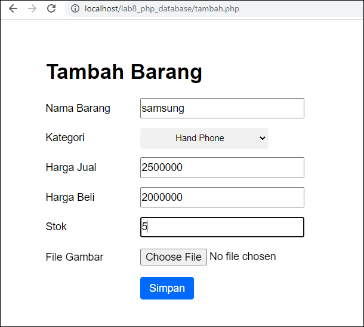
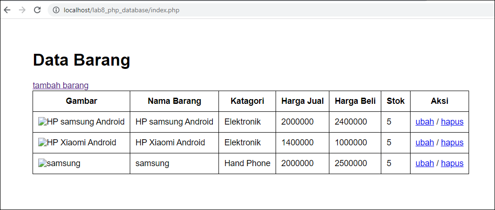

# Pratikum 8 Pemgrograman web

Nama    : Aka erlanda

Nim     : 312010207

Kelas   : TI.20.B.1

# Lab8Web

<b>Persiapan</b>

Untuk memulai membuat aplikasi CRUD sederhana, yang perlu disiapkan adalah database server menggunakan MySQL. Pastikan MySQL Server sudah dapat dijalankan melalui XAMPP.

1. Menjalankan MySQL Server

2. Mengakses MySQL Client menggunakan PHP MyAdmin

Pastikan webserver Apache dan MySQL server sudah dijalankan. Kemudian buka melalui browser: http://localhost/phpmyadmin/

3. Membuat Database: Studi Kasus Data Barang

- <b>Membuat Database</b>

CREATE DATABASE latihan1;

 <b>Membuat Tabel :</b>

 

 Berikut contoh tabelnya :

 

 <b>Menambahkan Data</b>

 

 Hasilnya akan seperti berikut :

 

 4. Membuat Program CRUD

Buat folder<b> "lab8_php_database" </b>pada root directory web server (d:\xampp\htdocs)

Kemudian untuk mengakses direktory tersebut pada web server dengan mengakses URL: http://localhost/lab8_php_database/

5. Membuat file koneksi database
Buat file baru dengan nama koneksi.php

Buka melalui chrome untuk menguji koneksi database (untuk menyampilkan pesan koneksi berhasil, uncomment pada perintah echo “koneksi berhasil” :

<b>Membuat file index untuk menampilkan data (Read)</b>

Disini saya menambahkan css style untuk memperbagus table nya.

berikut output nya :

<b>Menambah Data (Create)</b>

Buat file baru dengan nama "tambah.php"

di source kode nya saya menambahkan file css untuk memperbagus  halamannya.
Maka hasilnya outputnya seperti berikut :

<b>Mengubah Data</b>

Buat file baru dengan nama "ubah.php"

lalu buka dengan chrome.tapi pas outputnya seperti "ada yang salah" tapi setelah saya periksa kode input nya "tidak ada yang salah"

Berikut output nya : 

<b>Menghapus Data (Delete)</b>

Buat file baru dengan nama hapus.php

Berikut output nya :

# Terima kasih 

